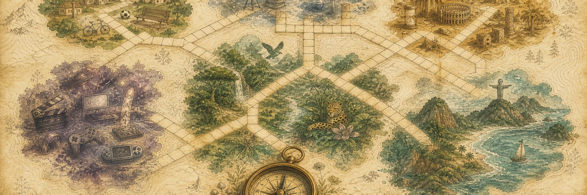
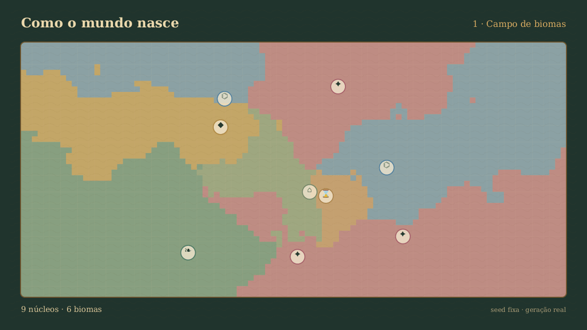
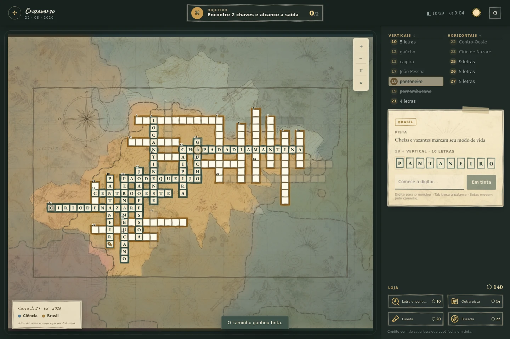

<p align="center">
  
</p>

# Cruzaverso

> Um mundo se cruza todos os dias.

[**Jogar agora →**](https://cruzaverso.duenas.dev.br)

Cruzaverso é um jogo de exploração por palavras para navegador. Cada resposta abre uma rota no atlas; cruzamentos viram interseções, ciclos revelam territórios e a expedição termina ao encontrar duas chaves e a saída. Sem combate ou derrota.

## Como o mundo nasce



A data vira uma seed determinística. O gerador desenha seis biomas, conecta chunks, cruza 84 palavras e escolhe uma seção Medium densa para o dia.

## Em jogo



Palavras em tinta viram caminhos. A névoa recua conforme o explorador avança; créditos compram pistas, letras e ferramentas de navegação.

## Self-host

Requer Docker com Compose:

```bash
docker compose up --build -d
```

Abra `http://localhost:3000`. O serviço escuta apenas em loopback e guarda edições e mapas livres no volume `cruzaverso-data`. Para acesso externo, publique-o por um reverse proxy com HTTPS.

Telemetria fica desligada. Para aceitar o opt-in dos jogadores, defina `TELEMETRY_ENABLED=true`; cada jogador ainda precisa habilitá-la nos ajustes.

## Desenvolvimento

Requer Node.js 22.12 ou superior.

- `npm run dev`: app e API locais.
- `npm test`: testes unitários e de integração.
- `npm run test:e2e`: jornadas no navegador.
- `npm run build`: typecheck e build de produção.
- `npm run validate:content`: valida o catálogo.
- `npm run capture:worldgen`: recria o GIF; requer `ffmpeg`.

## Licenças

- Código: [AGPL-3.0-only](LICENSE).
- Conteúdo, arte e documentação: [CC0-1.0](LICENSE-CONTENT).
- Fontes incluídas: [SIL Open Font License 1.1](public/assets/fonts/OFL.txt).

Conteúdo editorial e visual criado com ferramentas de IA e disponibilizado sob CC0-1.0.
